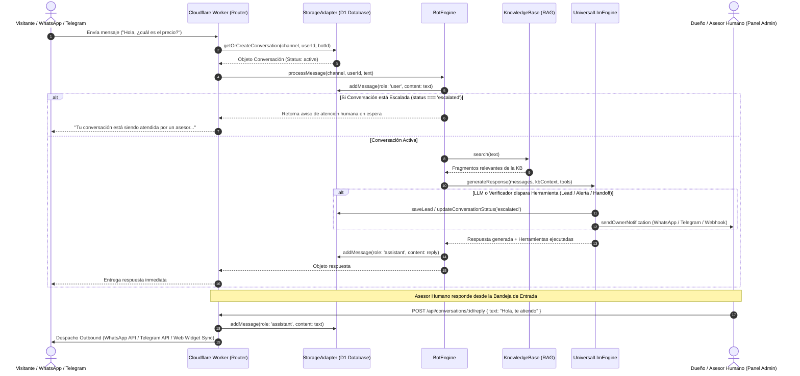

# 📚 FacilisBot — Documentación Técnica de Arquitectura y Guía para Desarrolladores

Bienvenido a la documentación integral de **FacilisBot**. Este documento detalla la arquitectura del sistema, el flujo de datos, los componentes clave, las funciones implementadas recientemente, posibles áreas de mejora y todo lo necesario para que cualquier ingeniero o agente de IA pueda continuar el desarrollo sin fricciones.

---

## 🧭 1. Resumen Ejecutivo y Propósito

**FacilisBot** es una plataforma serverless, multicanal y multi-inquilino (*multi-tenant*) de agentes de IA y CRM conversacional diseñada para operar con costo base cero y escalabilidad instantánea.

### Puntos clave de diseño:
1. **Doble Modo de Ejecución**:
   - **Producción Serverless**: Se ejecuta en **Cloudflare Workers** con base de datos **Cloudflare D1** (SQLite distribuido) y almacenamiento **Cloudflare KV** / Assets.
   - **Desarrollo Local / VPS**: Servidor nativo Node.js (`src/server/index.js`) con base de datos local SQLite (`better-sqlite3` / `sql.js`) y sistema de archivos local (`member/bots/*`).
2. **Aislamiento Multi-Tenant Estricto**:
   - Cada cliente o sucursal tiene un identificador único (`bot_id`).
   - Los datos de conversaciones, prospectos (leads), documentos de la base de conocimiento (KB) y ajustes están completamente aislados por `bot_id`.
   - Control de acceso por PIN (`masterAdminPin` para control global vs `clientPin` para acceso exclusivo a su propio bot).
3. **Multi-LLM Universal y Resiliencia**:
   - Conectividad nativa con **Google Gemini** (`gemini-3.5-flash-lite`, `gemini-3.7-flash`), **Anthropic Claude** (`claude-sonnet-5`, `claude-opus-5`), **OpenAI** (`gpt-5.6-luna`, `gpt-5.6-terra`) y **xAI Grok** (`grok-4.6`).
   - Simulador Offline de Respaldo (*Zero-Miss Mock Fallback*) para garantizar operatividad aún si las API keys caducan o se agotan.
4. **12 Superpoderes de Negocio (Function Calling)**:
   - Captura automática de prospectos (`capture_lead`), alerta de quejas y clientes molestos (`alert_vigilante`), handoff a asesor humano (`escalate_to_human`), cobros en línea (`create_payment_link`), agendamiento (`book_appointment`), recolección de reseñas (`collect_review`), seguimiento diferido (`snooze_user`) y búsqueda en base de conocimiento (`search_kb`).

---

## 🏗️ 2. Estructura del Código

```text
facilisbot/
├── bin/
│   └── facilisbot.js             # CLI interactivo (init, doctor, list, serve, backup)
├── member/                       # Almacenamiento local para desarrollo
│   └── bots/
│       ├── default/              # Configuración y KB del bot principal
│       │   ├── config.json
│       │   └── kb/               # Archivos Markdown de la KB
│       └── [bot_id]/             # Bots de clientes aislados
├── src/
│   ├── core/                     # Núcleo de lógica independiente de la plataforma
│   │   ├── channels/             # Controladores de mensajería
│   │   │   ├── whatsapp.js       # Meta Cloud API (Webhooks y Outbound)
│   │   │   ├── telegram.js       # Telegram Bot API (Webhook y Polling)
│   │   │   ├── instagram.js      # Instagram Graph API
│   │   │   ├── messenger.js      # Facebook Messenger API
│   │   │   └── web.js            # Interfaz de mensajería web
│   │   ├── kb/                   # Motor de Base de Conocimiento (RAG)
│   │   │   └── index.js          # Indexación, chunking y búsqueda semántica/léxica
│   │   ├── llm/                  # Puente Multi-LLM y Function Calling
│   │   │   └── index.js          # Adaptadores para Gemini, Claude, OpenAI, Grok
│   │   ├── tools/                # Registro de las 12 herramientas de negocio
│   │   │   └── registry.js       # Ejecutor de herramientas y notificaciones al dueño
│   │   └── engine.js             # Orquestador BotEngine (Ciclo de vida del mensaje)
│   ├── storage/                  # Capa de Abstracción de Persistencia
│   │   ├── index.js              # Factory de StorageAdapter
│   │   ├── local.js              # Adaptador Local (SQLite + Filesystem)
│   │   └── cloudflare.js         # Adaptador Cloudflare (D1 Database + KV)
│   ├── public/                   # Frontend estático servido por Cloudflare Assets
│   │   ├── admin/                # Panel de Control Administrativo
│   │   │   ├── index.html        # Estructura SPA (Flujo, KB, Inbox, Leads, Conexiones)
│   │   │   ├── app.js            # Lógica SPA, sincronización en vivo, audio chime
│   │   │   └── style.css         # Diseño CSS premium y layout flexbox con scroll fluido
│   │   └── widget/               # Widget de Chat Web Embebible
│   │       ├── widget.js         # Script flotante con sincronización bidireccional
│   │       └── widget.css        # Estilos modernos del widget de chat
│   ├── server/
│   │   └── index.js              # Servidor HTTP local Node.js (modo desarrollo)
│   └── worker.js                 # Router principal para Cloudflare Workers
├── test/
│   └── verify.js                 # Suite de 91 pruebas de integración automáticas
├── wrangler.toml                 # Configuración de despliegue en Cloudflare Workers & D1
└── package.json
```

---

## 🔄 3. Flujo de Datos y Ciclo de Vida del Mensaje



---

## 🧩 4. Funcionalidades Recientes y Cómo Fueron Construidas

### 4.1. Entrevista Guiada para Crear la Base de Conocimiento (`POST /api/kb/interview/step`)
- **Objetivo**: Permitir a cualquier usuario no técnico crear la base de conocimiento de su negocio respondiendo preguntas guiadas en 6 pasos.
- **Implementación**:
  - `src/worker.js` y `src/server/index.js` exponen el endpoint que recibe `{ step, answers, botId }`.
  - Genera automáticamente 6 documentos Markdown limpios:
    1. `perfil_ubicacion.md`
    2. `horarios_atencion.md`
    3. `servicios_productos.md`
    4. `precios_pagos.md`
    5. `politicas_garantias.md`
    6. `preguntas_frecuentes.md`
  - Persiste los documentos en Cloudflare D1 (`kb_documents`) o en `member/bots/[bot_id]/kb/`.

### 4.2. Scraper Web Inteligente (`POST /api/kb/scrape`)
- **Objetivo**: Extraer contenido de páginas web y generar archivos de KB automáticamente.
- **Implementación**:
  - Realiza un fetch HTTP con cabecera `User-Agent` de navegador.
  - Elimina etiquetas ruidosas (`<script>`, `<style>`, `<nav>`, `<footer>`, `<svg>`).
  - Convierte los encabezados (`h1`-`h6`), párrafos y listas en Markdown limpio.
  - **Soporte multi-página por variante**: Convierte URLs como `empresa.com/sobre-nosotros` en `web_empresa_com_sobre_nosotros.md`, evitando colisiones o sobreescritura entre subpáginas del mismo dominio.

### 4.3. Despachador de Alertas Inmediatas al Celular (`sendOwnerNotification`)
- **Objetivo**: Notificar en tiempo real al dueño o encargado cuando:
  - Se captura un nuevo prospecto calificado (`capture_lead`).
  - Un cliente está molesto o enojado (`alert_vigilante`).
  - El cliente pide expresamente hablar con una persona (`escalate_to_human`).
  - Se agenda una cita (`book_appointment`).
- **Implementación en `src/core/tools/registry.js`**:
  - **WhatsApp**: Disparo vía Meta Graph API a `ownerWhatsappPhone`.
  - **Telegram**: Mensaje formateado en Markdown vía Telegram Bot API a `telegramChatId`.
  - **Webhooks**: Disparo HTTP POST con payload JSON hacia Make, Zapier o n8n (`webhookUrl`).

### 4.4. Bandeja de Entrada en Tiempo Real, Alertas y Controles del Bot
- **Objetivo**: Control total sobre las conversaciones, avisos inmediatos y capacidad de pausar o reanudar el bot.
- **Implementación en `src/public/admin/app.js` e `index.html`**:
  - **Live Polling Heartbeat**: Bucle de sincronización cada 2.5s (`startLiveSync`) que detecta nuevos mensajes y casos escalados.
  - **Campana de Audio Acústica**: Generada en tiempo real mediante `AudioContext` (Web Audio API) sin requerir archivos de audio externos.
  - **Banner de Alerta Superior**: Notificación visual pulsante con acceso rápido a la conversación.
  - **Controles de Estado del Bot**:
    - `🤖 Reactivar Bot`: Llama a `POST /api/conversations/:id/status` con `{ status: 'active' }`.
    - `⏸️ Pausar Bot`: Permite al humano tomar control exclusivo `{ status: 'escalated' }`.
    - `✅ Resolver Ticket`: Resuelve el caso y deja al bot listo para nuevas consultas `{ status: 'resolved' }`.

### 4.5. Entrega Bidireccional de Respuestas Humanas
- **Para Web Widget**: `widget.js` consulta periódicamente `GET /api/chat/messages?sessionId=...&botId=...`. Cuando el asesor responde en el panel, el mensaje aparece de inmediato en el chat del usuario.
- **Para WhatsApp**: `POST /api/conversations/:id/reply` invoca `WhatsAppHandler.sendCloudApiMessage`, entregando el texto directo al WhatsApp del usuario.
- **Para Telegram**: Invoca `TelegramHandler.sendMessage`.

### 4.6. Desplazamiento Fluido en CSS (Flexbox Scroll Fix)
- Se aplicó `min-height: 0;` y `height: 100%;` en los contenedores flexbox de `.inbox-layout`, `.chat-viewer` y `.chat-messages` en `src/public/admin/style.css`, corrigiendo el corte de mensajes y habilitando scroll vertical completo con auto-desplazamiento automático al fondo (`scrollChatToBottom`).

### 4.7. Sanitización de Mensajes para la API de Gemini
- En `src/core/llm/index.js`, la función `callGeminiLoop` ahora sanitiza y fusiona mensajes consecutivos para garantizar la alternancia estricta `user` -> `model` -> `user` requerida por la API de Google Gemini, eliminando errores `400 Bad Request`.

---

## 📡 5. Referencia de Endpoints de la API

| Método | Ruta | Descripción |
|---|---|---|
| `GET` | `/health` | Chequeo de salud del worker y estado de conexiones |
| `POST` | `/api/auth` | Login de administradores y clientes por PIN |
| `GET` | `/api/overview` | Métricas y KPIs agregados por `bot_id` |
| `GET` | `/api/config` | Obtiene la configuración del bot |
| `POST` | `/api/config` | Guarda la configuración del bot (Ajustes, canales, LLM, alertas) |
| `POST` | `/api/test/connection` | Valida en vivo si la API Key de Gemini, Claude, OpenAI o Grok es válida |
| `POST` | `/api/chat` | Endpoint principal de mensajería para el Widget Web |
| `GET` | `/api/chat/messages` | Sincroniza en tiempo real el historial de un usuario web |
| `POST` | `/api/test/chat` | Simulador interactivo de chat |
| `GET` | `/api/conversations` | Lista conversaciones filtradas por canal y estatus |
| `GET` | `/api/conversations/:id/messages` | Retorna los mensajes de una conversación |
| `POST` | `/api/conversations/:id/reply` | Envía un mensaje como asesor humano (entrega a Web, WhatsApp, Telegram) |
| `POST` | `/api/conversations/:id/status` | Cambia el estado: `active`, `escalated`, `resolved` |
| `GET` | `/api/leads` | Lista de prospectos capturados con filtros de búsqueda |
| `PUT` | `/api/leads/:id` | Actualiza estado o notas de un prospecto |
| `GET` | `/api/leads/export/csv` | Exporta la base de leads a archivo CSV |
| `GET` | `/api/kb` | Lista todos los documentos Markdown de la KB |
| `POST` | `/api/kb` | Guarda o actualiza un documento Markdown |
| `GET` | `/api/kb/:filename` | Obtiene el contenido de un documento Markdown |
| `DELETE` | `/api/kb/:filename` | Elimina un documento de la base de conocimiento |
| `POST` | `/api/kb/interview/step` | Guarda un paso de la entrevista guiada |
| `POST` | `/api/kb/scrape` | Extrae contenido de una URL web y lo guarda en la KB |
| `GET` | `/webhook/whatsapp` | Desafío de verificación de Meta Webhook |
| `POST` | `/webhook/whatsapp` | Recepción de mensajes entrantes de WhatsApp |
| `POST` | `/webhook/telegram` | Recepción de mensajes de Telegram (modo Webhook) |

---

## ⚠️ 6. Posibles Problemas a Prever y Roadmap para Futuros Desarrolladores

1. **Escala Masiva de Conexiones Web (WebSockets vs Polling)**:
   - *Situación actual*: El widget web y el panel de administración utilizan Live Polling HTTP cada 2.5s. Esto es ultra-ligero y funciona de maravilla en Cloudflare Workers.
   - *Recomendación a futuro*: Si una sola instancia supera más de 10,000 usuarios chateando simultáneamente al mismo segundo, considerar migrar la capa de chat a **Cloudflare Durable Objects + WebSockets** para comunicación bidireccional permanente con push instantáneo.

2. **RAG Vectorial Avanzado (Cloudflare Vectorize)**:
   - *Situación actual*: El motor RAG utiliza indexación en memoria y búsqueda léxica/semántica ponderada, lo cual es instantáneo para bases de conocimiento de 1 a 100 documentos por negocio.
   - *Recomendación a futuro*: Para catálogos masivos con miles de productos o PDFs extensos, habilitar el binding con **Cloudflare Vectorize** usando embeddings de `text-embedding-004`.

3. **Confirmación Automática de Pagos**:
   - *Situación actual*: La herramienta `create_payment_link` genera enlaces de pago y solicita el comprobante.
   - *Recomendación a futuro*: Conectar webhooks entrantes de Stripe (`/webhook/stripe`) o Mercado Pago para marcar el lead como "pagado" automáticamente sin intervención humana.

---

## 🛠️ 7. Guía de Comandos para Desarrollo y Despliegue

```bash
# 1. Ejecutar la suite completa de pruebas unitarias e integración (91 pruebas)
npm test

# 2. Iniciar el servidor local de desarrollo
npm run dev

# 3. Desplegar cambios a Cloudflare Workers y D1
npx wrangler deploy

# 4. Inspeccionar registros en vivo en Cloudflare
npx wrangler tail

# 5. Ejecutar consultas SQL directas en la base de datos D1 en producción
npx wrangler d1 execute facilisbot-db --remote --command="SELECT COUNT(*) FROM conversations;"
```
